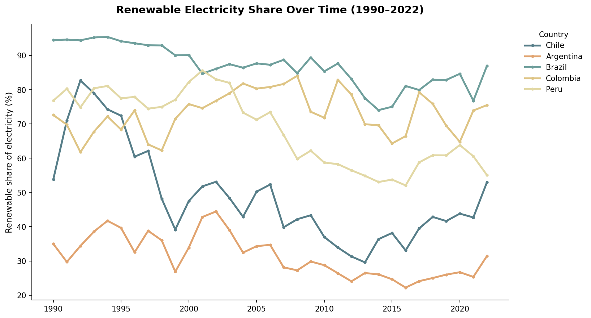
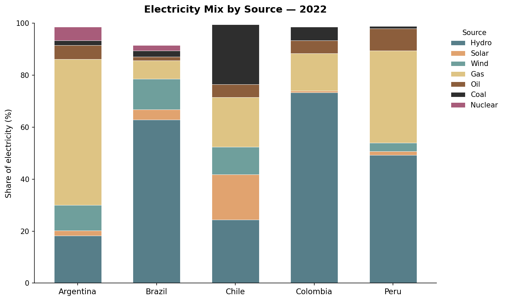
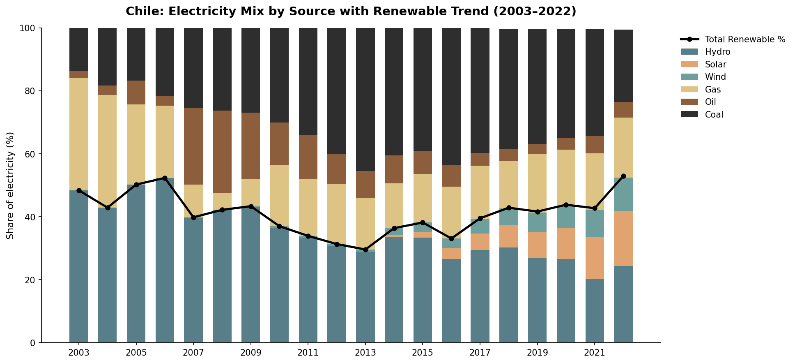

# Renewable Energy in Latin America: Chile in Regional Context

Comparative analysis of renewable electricity adoption in Chile, Argentina, 
Brazil, Colombia, and Peru (1990-2022), including a deeper look at how 
Chile's own energy mix evolved over the last 20 years and why.

## Background

Built as a self-directed learning project bridging my ESG/sustainability 
reporting background (CDP) with hands-on data analysis using pandas and 
matplotlib in Google Colab.

## Question

How does Chile's renewable energy adoption compare to its Latin American 
neighbors, what specific sources make up that mix, and what's driving the 
changes over time?

## Data source

**Our World in Data - Energy Dataset** (via Kaggle: "World Energy Consumption")

Initially started with World Bank ESG data, which only provided an aggregate 
"renewable energy consumption %" figure. Switched to this dataset because it 
breaks down electricity generation by specific source (hydro, solar, wind, 
coal, gas, oil, nuclear) and covers a longer, more recent time range 
(1990-2022 vs. 1990-2014).

## Finding 1: Renewable share over time (1990-2022)

Renewable electricity share **declined** across all five countries from 1990 
through the mid-2010s- likely reflecting energy demand growth (industrialization, 
mining, population growth) outpacing renewable capacity additions. From roughly 
2018 onward, most countries, especially Chile and Brazil, show a renewed 
upward trend, coinciding with the global acceleration in solar and wind investment.

## Finding 2: Electricity mix by source (2022)

Brazil and Colombia lean heavily on hydroelectric power (60-75% of their grid). 
Argentina relies primarily on gas (~55%), reflecting its substantial domestic 
natural gas reserves (notably Vaca Muerta). **Chile stands out for having the 
most diversified electricity mix** of the five, with meaningful contributions from 
hydro, solar (~17%), and wind (~10%), alongside continued coal and gas use.

## Finding 3: Chile's energy mix over time, and why coal spiked (2003-2022)

Zooming into Chile specifically reveals a sharp rise in coal use starting 
around 2004, which initially looked like it might track economic growth. 
Investigating further revealed a more specific, verified explanation: 
**Argentina restricted natural gas exports to Chile starting 2004** amid its 
own domestic energy crisis, with export cuts peaking in 2007 at over half of 
prior shipments. Chile had built roughly 3 GW of gas-fired capacity in the 
1990s around cheap Argentine gas, so the shortage hit hard and natural gas 
prices in Chile reportedly rose from around $84 to over $400 per million m³ 
between 2004 and 2008, while consumption collapsed. Facing this shock, Chile 
turned to coal and diesel as the cheapest available substitutes, driving the 
coal increase visible in the chart.

This is a geopolitical and supply-security story, not an economic growth 
story, a good reminder that a plausible-looking correlation (coal rising 
alongside GDP) isn't the same as a verified causal explanation.

*Source: [Chile's electricity markets: Four decades on from their original 
design, ScienceDirect](https://www.sciencedirect.com/science/article/pii/S2211467X21001814)*

## Conclusion

Chile's diversified 2022 electricity mix is the product of two distinct 
forces: a supply shock (the 2004-2007 Argentine gas cutoff) that pushed it 
toward coal in the late 2000s, followed by a deliberate, more recent shift 
toward solar and wind, leveraging strong solar resources in the Atacama 
Desert. This contrasts with Brazil and Colombia, whose high renewable share 
comes from a single legacy source (hydro) rather than a diversified 
portfolio, a distinction that matters for energy security and grid 
resilience, not just renewable %.

## Tools used

Python, pandas, matplotlib, Google Colab

## Files in this repo

- `latam_renewables_analysis.ipynb` - full notebook with code and outputs
- `latam_renewables_trend_1990_2022.png` - renewable share over time (5 countries)
- `latam_electricity_mix_2022.png` — electricity mix by source, 2022 (5 countries)
- `chile_electricity_mix_trend.png` — Chile's energy mix evolution, 2003-2022
